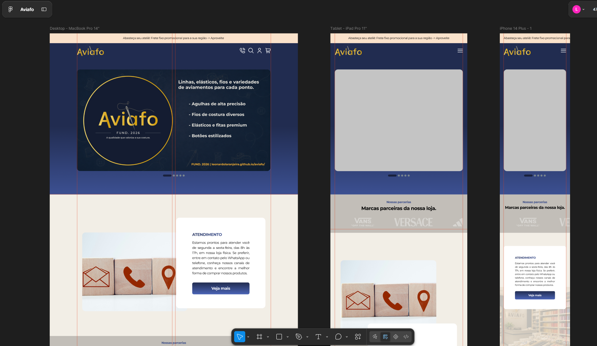
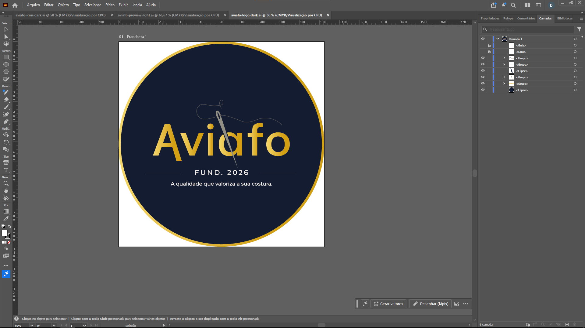
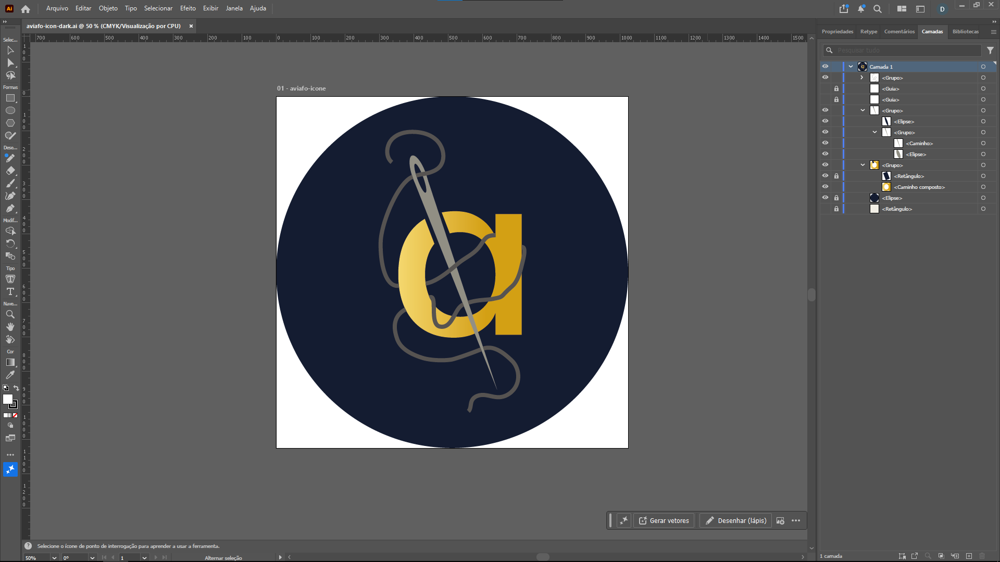
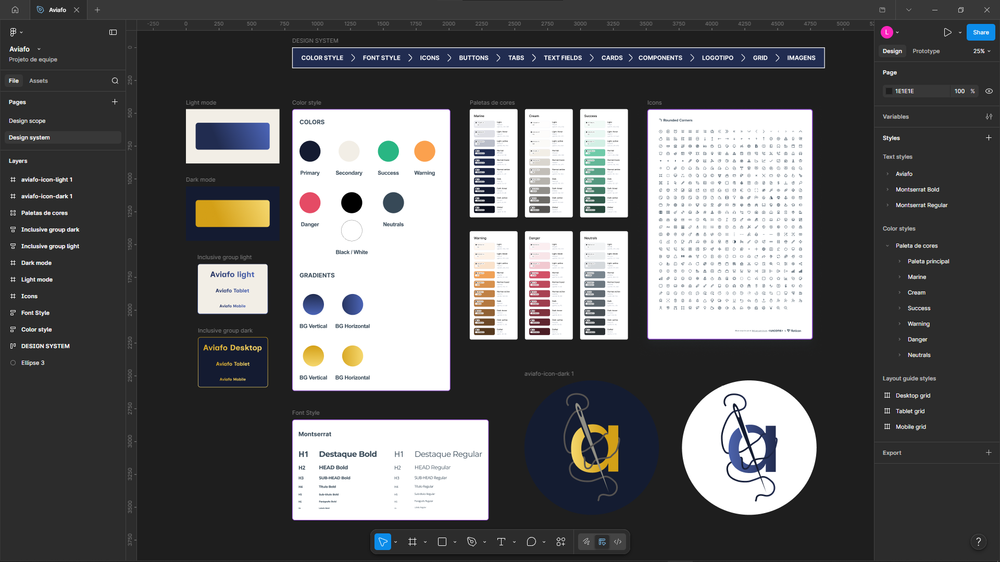
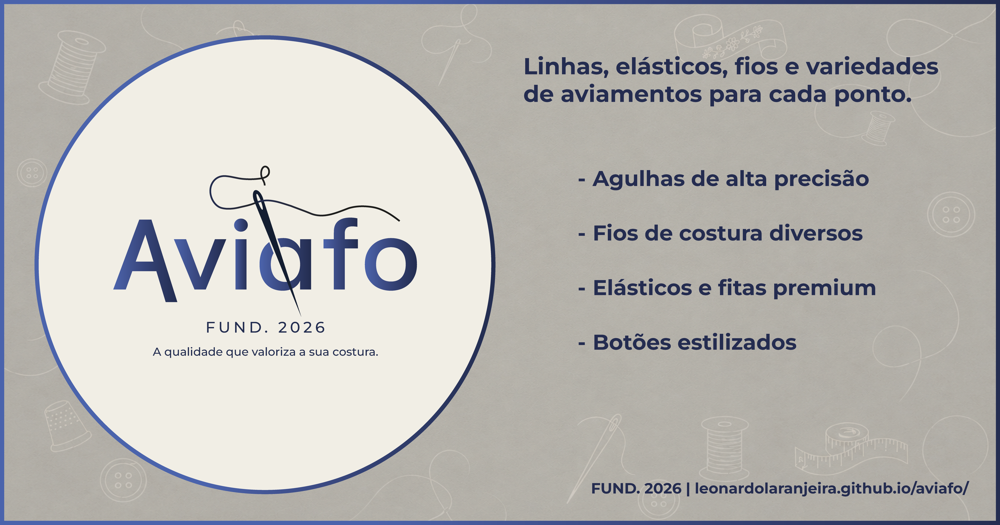
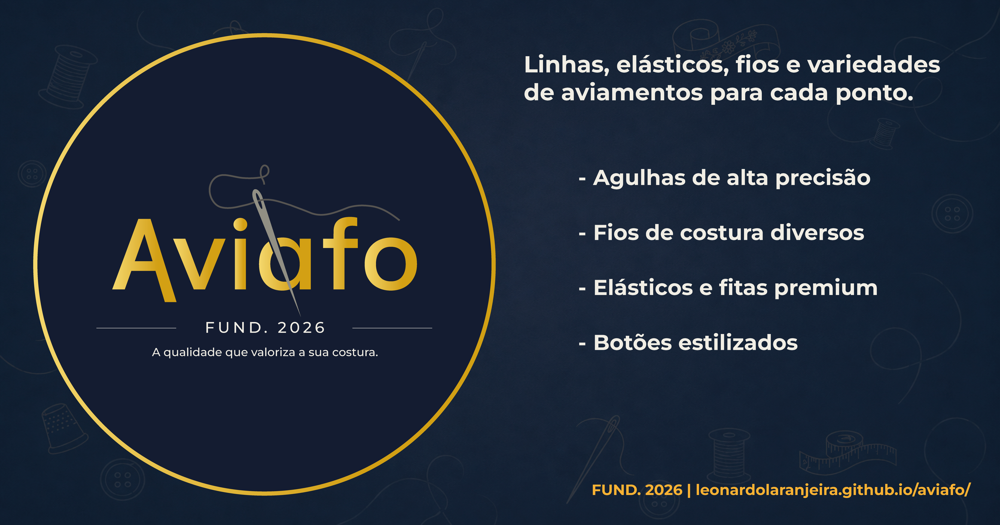

# 🛒 Aviafo - Haberdashery E-commerce

Aviafo is a professional full-stack web application designed to manage and sell haberdashery products (threads, yarns, elastics, and velcro). This project highlights the integration of a robust Java backend with a strictly normalized SQL Server database, delivering a seamless experience through a dynamic web interface.

---

## 🛠 Tech Stack

- **Backend:** Java 25 (LTS) with Spring Boot and Maven
- **Database:** SQL Server (Normalized following 1NF, 2NF, and 3NF rules)
- **Frontend:** HTML5, Tailwind CSS, and JavaScript
- **Architecture:** Layered MVC (Model-View-Controller)

---

## 🎨 Phase 1 — Visual Identity & Design System

Before writing a single line of code, Aviafo went through a complete visual identity and design system phase, ensuring a consistent, professional, and cohesive brand experience across the entire application.

### Brand Identity

The visual identity was built from scratch using **Adobe Illustrator**, starting with the brand concept and evolving through multiple iterations until reaching the final result.

- **Logotype:** Custom wordmark combining a modern sans-serif typeface with a hand-crafted needle illustration integrated directly into the letterforms, reinforcing the haberdashery theme.
- **Slogan:** *"A qualidade que valoriza a sua costura."* — positioned below the logotype as a brand statement.
- **Icon:** A simplified version of the brand mark featuring the letter **"a"** intertwined with a needle and thread, designed for use as a favicon, app icon, and UI element. Available in both **light** and **dark** mode variants.

#### Theme Variants

| ☀️ Light Mode Theme | 🌙 Dark Mode Theme |
|---|---|
|  |  |

### Color System

The color palette was carefully defined using **Adobe Color** and the **Figma Plugin — Foundation**, with each color serving a specific role in the interface:

| Palette | Role | Usage |
|---|---|---|
| **Primary (Navy Blue)** | Brand identity | Buttons, headers, key UI elements |
| **Secondary (Warm Cream/Grey)** | Neutral base | Backgrounds, cards, surfaces |
| **Success (Green)** | Positive feedback | Order confirmed, in stock, form success |
| **Warning (Orange)** | Alerts | Low stock, incomplete fields |
| **Danger (Red)** | Error states | Payment failure, out of stock, invalid input |
| **Neutrals (Cool Grey)** | Interface structure | Text, borders, icons, shadows |

Each palette includes a full range of tonal variations (Light, Normal, Dark, Darker) with hover and active states to support interactive components.

#### Button & CTA System

- **Light mode:** Solid navy blue button on cream background
- **Dark mode:** Gold linear gradient button on navy blue background

### Typography

- **Primary font:** [Montserrat](https://fonts.google.com/specimen/Montserrat) (Google Fonts) — used across all interface text, from display headings to body copy and labels.
- **Type scale:** Defined across 7 levels (H1 through Labels), each available in **Bold** and **Regular** weights, ensuring clear visual hierarchy throughout the application.

### Design System

The full design system was structured and documented in **Figma**, organized into the following sections:

- **Color Style** — All palettes with light/dark mode variants
- **Font Style** — Complete typographic scale
- **Icons** — Rounded icon library (Rounded Corners set)
- **Buttons** — CTA components for light and dark modes
- **Tabs** — Navigation tab components
- **Text Fields** — Input field components
- **Cards** — Product and content card components
- **Components** — Reusable UI elements
- **Logotipo** — Brand mark in all variants (light, dark, icon)
- **Grid** — Layout grid system
- **Imagens** — Image usage guidelines

### UI Prototyping

The design system was applied to a responsive prototype covering Desktop, Tablet, and Mobile breakpoints, built entirely in **Figma** before any frontend code was written.

### Design Drafts

#### Logo Concept

#### Icon Concept

#### Design System

### Interface Previews (Mockups)

Visual demonstration of how the design system adapts across dark and light environments:

| Light Mode Interface | Dark Mode Interface |
|---|---|
|  |  |

### Tools Used in This Phase

| Tool | Purpose |
|---|---|
| Adobe Illustrator | Logo and icon creation and editing |
| Figma | Design system organization and UI prototyping |
| Figma Plugin — Foundation | Color palette and gradient generation |
| Adobe Color | Color palette generation and harmony validation |
| Google Fonts | Typography selection (Montserrat) |

---

## 🗄 Phase 2 — Database Engineering & ER Modeling

Before implementing the backend, a complete Entity-Relationship Diagram (ERD) was designed to ensure a normalized, scalable, and professionally structured database, strictly following 1NF, 2NF, and 3NF normalization rules.

### Entity-Relationship Diagram

### Core Entities & Responsibilities

| Entity | Responsibility |
|---|---|
| **Cliente** | Stores customer personal data (name, email, CPF, phone) |
| **Endereco** | Delivery and billing addresses linked to each customer |
| **Produto** | Product catalog with SKU, price, category, and status |
| **Categoria** | Hierarchical product categorization (supports subcategories via self-reference) |
| **Estoque** | Stock control with minimum and maximum quantity constraints |
| **Carrinho** | Active shopping cart per customer session |
| **CarrinhoItem** | Individual items inside the shopping cart |
| **Pedido** | Confirmed orders with subtotal, freight, discount, and delivery date |
| **PedidoItem** | Order line items with frozen unit price at the time of purchase |
| **Pagamento** | Payment records with method, status, and due date |
| **Cupom** | Discount coupons with type, value, and expiration control |
| **Avaliacao** | Product reviews and ratings submitted by customers |
| **Newsletter** | Email subscription management with active/inactive status |

### Normalization Compliance

- **1NF** — All columns hold atomic values. Multi-valued attributes (e.g., product images, addresses) are separated into dedicated tables.
- **2NF** — No partial dependencies. Every non-key attribute depends on the entire primary key of its table.
- **3NF** — No transitive dependencies. Calculated or derived values (e.g., order total) are not duplicated across tables.

### Key Design Decisions

- **Frozen price in PedidoItem:** The `precoUnitario` field is copied from the product at the time of purchase, ensuring order history is never affected by future price changes.
- **Self-referencing Categoria:** The `CategoriaPaiID` foreign key enables unlimited category depth (e.g., *Linhas → Linhas de Bordado → Linhas Metalizadas*).
- **Estoque as a separate entity:** Stock data is decoupled from the product table, enabling independent quantity tracking with minimum and maximum thresholds.
- **Cupom linked to Pedido:** Discount coupons are optionally applied per order, keeping the pricing logic centralized and auditable.

### Tools Used in This Phase

| Tool | Purpose |
|---|---|
| dbdiagram.io | Entity-Relationship Diagram modeling and SQL export |
| DataGrip | SQL Server scripting, validation, and database management |

---

## 🏗 Database Engineering

The Aviafo project prioritizes high-level data integrity and performance:

- **Database Normalization:** Applied to eliminate redundancies and ensure data consistency.
- **SQL Constraints:** Implementation of PK, FK, and CHECK constraints to enforce business rules, such as preventing negative stock levels.
- **Management:** Developed using DataGrip for professional-grade SQL scripting and optimization.

---

## 📂 Project Structure (Planned)

- `src/main/java/.../controller` — API endpoints and HTTP request handling.
- `src/main/java/.../service` — Core business logic and rules.
- `src/main/java/.../model` — Database entities and JPA mappings.
- `src/main/java/.../repository` — Data access layer for SQL Server communication.
- `src/main/java/.../dto` — Data Transfer Objects for secure data exchange.
- `src/main/java/.../infra` — Infrastructure and global error handling.

---

## 🚀 Project Highlights

- **Cutting-edge Backend:** Developed using Java 25 and Spring Boot, leveraging the latest features for high-performance and future-proof code.
- **Professional Database Engineering:** Architecture centered on a SQL Server database, strictly following 1NF, 2NF, and 3NF normalization rules to ensure data integrity.
- **Robust Data Integrity:** Implementation of advanced SQL Constraints (PK, FK, and CHECK) to enforce business logic directly at the database level.
- **Modern Full-stack Integration:** A dynamic web interface built with Tailwind CSS and Vanilla JavaScript, communicating with a structured Java REST API.
- **Professional Tooling:** Workflow optimized with high-performance tools like IntelliJ IDEA, DataGrip for database management, Maven for build automation, and Swagger (OpenAPI 3) for interactive API documentation.
- **Clean Architecture:** Implementation of a layered MVC (Model-View-Controller) pattern, ensuring a clear separation of concerns between business logic and data access.
- **Complete Design System:** A fully documented visual identity and design system built before development, ensuring UI consistency across all application screens and states.
- **Responsive UI Prototyping:** Full interface prototype designed in Figma across Desktop, Tablet, and Mobile breakpoints before any frontend code was written.
